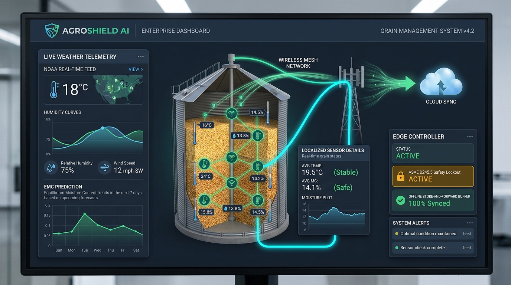

# AgroShield AI — Climate Risk & Grain Storage Preservation Engine

<p align="center">
  
  
  
  
  
</p>

<p align="center">
  
</p>

> **Autonomous predictive and fail-safe system designed to prevent post-harvest grain spoilage, thermal shock condensation, and mycotoxin loss across United States storage bins.**  
> Developed and Engineered by **Enzo Oliveira dos Santos** (Agribusiness Specialist & M.Sc. Candidate in Software Engineering).

---

## 🌾 The National Problem (US Critical Infrastructure)

The **Cybersecurity and Infrastructure Security Agency (CISA)** and the **Department of Homeland Security (DHS)** classify the **Food and Agriculture Sector** as Critical Infrastructure. 

In the Midwest (Iowa, Illinois, Nebraska), extreme weather swings in autumn and winter cause **internal condensation** in grain bins:
* Warm grain (20°C+) creates rising moisture plumes that hit freezing corrugated steel roofs.
* Water condenses and drips onto the top surface, triggering rapid **crusting, fungal growth (*Aspergillus*), and mycotoxin contamination**.
* Unmanaged fan aeration in humid weather forces water into dry grain, destroying market value.

**AgroShield AI** provides an autonomous bridge between agrophysical principles and machine learning to predict risks 72 hours in advance and automate aeration decision support.

---

## 🏛️ System Architecture & Dual-Consensus Safety Protocol

```
                  NOAA Mesoscale Ingestion (Live + 72h Forecast)
                                  │
                                  ▼
           ┌──────────────────────────────────────────────┐
           │   Autonomous Watchdog (Hourly Telemetry)     │
           │        72h Safe Aeration Scheduling          │
           └──────────────────────┬───────────────────────┘
                                  │
                                  ▼
           ┌──────────────────────────────────────────────┐
           │      Equilibrium Moisture Content (EMC)      │
           │         Henderson-Thompson Equation          │
           │              (ASAE D245.5)                   │
           └──────────────────────┬───────────────────────┘
                                  │
                                  ▼
           ┌──────────────────────────────────────────────┐
           │        Machine Learning Risk Classifier      │
           │         Scikit-Learn Ensemble (RF)           │
           │       98.44% Accuracy · 0.9807 F1-Score      │
           └──────────────────────┬───────────────────────┘
                                  │
                                  ▼
           ┌──────────────────────────────────────────────┐
           │   FastAPI Resilient Microservice + Fail-Safe │
           │   Security Headers + Hard Hardware Lockout   │
           └──────────────────────┬───────────────────────┘
                                  │
          ┌───────────────────────┴───────────────────────┐
          ▼                                               ▼
[Automated Aeration Relays]                  [Executive Decision Console]
(FAN_RELAY_LOCKOUT / STAGE 1 / STAGE 2)     (Streamlit Financial ROI Audit)
```

---

## 🛡️ Zero-Failure Assurance (Dual-Consensus Protocol)

* **Layer 1 (Statistical ML):** Scikit-Learn Random Forest Classifier predicts spoilage probability (98.44% accuracy).
* **Layer 2 (Deterministic Agrophysics):** Modified Henderson-Thompson physical boundary guardrail.
* **Fail-Safe Override:** If Layer 1 and Layer 2 ever conflict, **Layer 2 (Agrophysical Safety) always overrides Layer 1**. If outside ambient EMC exceeds grain moisture + 0.8%, fan relays are unconditionally locked at the hardware level.

---

## 📐 Mathematical Formulation (Henderson-Thompson)

The agrophysical core evaluates the Equilibrium Moisture Content ($M_{\text{dry}}$) between ambient air and grain mass:

$$M_{\text{dry}} = \left[ \frac{-\ln(1 - \text{RH})}{K \cdot (T + C)} \right]^{\frac{1}{N}}$$

* **Corn (Dent Yellow):** $K = 8.6541 \times 10^{-5}, \quad C = 49.810, \quad N = 1.8634$
* **Soybeans:** $K = 1.1172 \times 10^{-4}, \quad C = 91.560, \quad N = 1.7010$

---

## 📊 Benchmark Results & Test Suite

| Metric | Result | Standard / Method |
| :--- | :---: | :--- |
| **Automated Test Suite** | **26 / 26 Passed (100%)** | Pytest & Unittest CI/CD |
| **Test Accuracy** | **98.44%** | Stratified Holdout (640 samples) |
| **F1-Score (Macro)** | **0.9807** | Multi-class (Safe / Aerate / Critical) |
| **5-Fold Cross Validation** | **0.9803 $\pm$ 0.0112** | 5-Fold Stratified CV |
| **Top Feature** | **Moisture % (45.2%)** | Gini Feature Importance |
| **Second Feature** | **Thermal Gradient (25.8%)** | Headspace Condensation Driver |

---

## 🚀 Quickstart & Execution

### 1. Installation
```bash
git clone https://github.com/enzooliveiradossantos1997-hash/agroshield-ai.git
cd agroshield-ai
pip install -r requirements.txt
```

### 2. Run the Full Test Suite
```bash
python -m pytest tests/ -v
```
*Expected: 26/26 tests pass with 100% OK.*

### 3. Start the Executive Financial Dashboard
```bash
streamlit run src/dashboard/app.py
```
Open interactive dashboard: [http://localhost:8501](http://localhost:8501)

### 4. Start the Microservice API
```bash
uvicorn src.api.main:app --port 8000
```
Open interactive Swagger documentation: [http://localhost:8000/docs](http://localhost:8000/docs)  
Prometheus Metrics: [http://localhost:8000/metrics](http://localhost:8000/metrics)

### 5. Production Docker Deployment
```bash
docker-compose up --build -d
```

---

## 📑 Technical Whitepaper & Immigration Dossier

Read the complete engineering and agronomic specification for institutional or immigration review (*Matter of Dhanasar, EB-2 NIW*):  
👉 [docs/whitepaper_grain_loss_mitigation.md](docs/whitepaper_grain_loss_mitigation.md)

---

## 👤 Author & Architecture

**Enzo Oliveira dos Santos**  
* Graduate in Agribusiness Management
* Master of Science Candidate in Software Engineering
* Contact: enzooliveiradossantos1997@gmail.com
* GitHub: [@enzooliveiradossantos1997-hash](https://github.com/enzooliveiradossantos1997-hash)

---

© 2026 AgroShield AI · All rights reserved.
